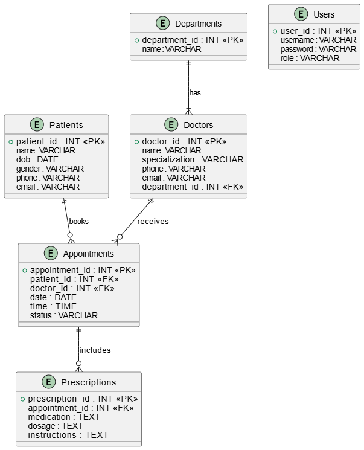
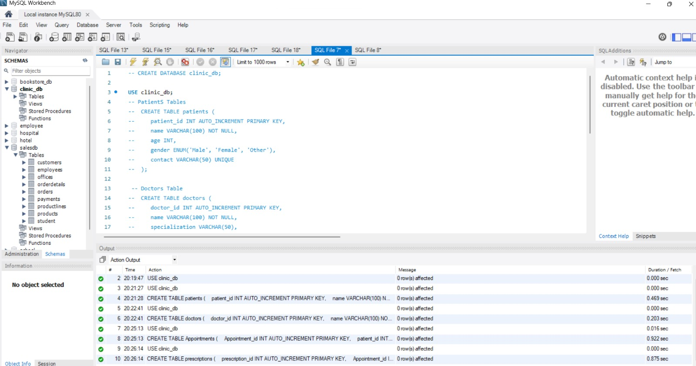
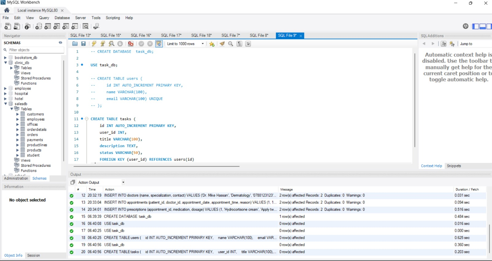
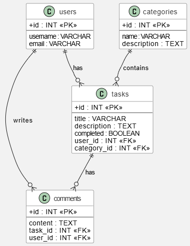
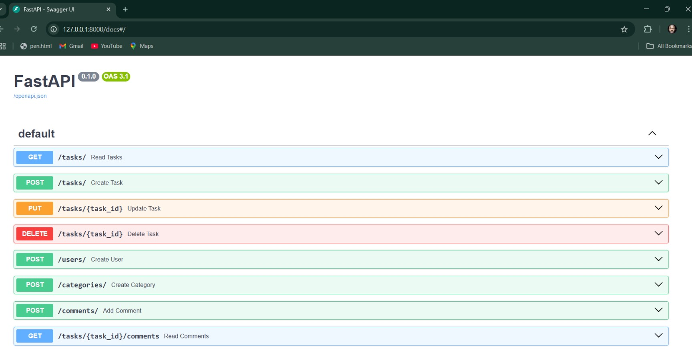
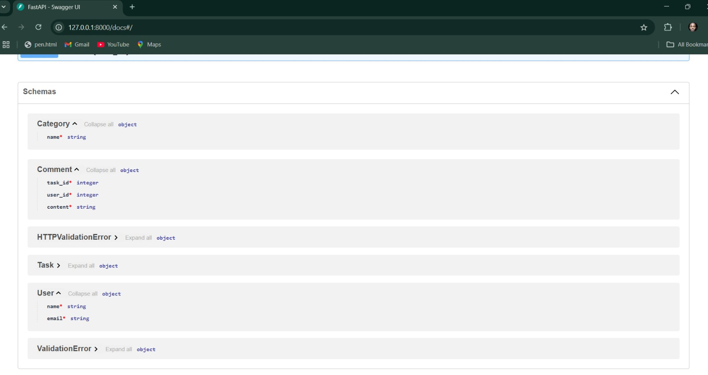

# Clinic Task Manager App

## Clinic Booking System

## Project Description:

The Clinic Booking System is a MySQL-based database designed to manage the operations of a healthcare clinic. It focuses on organizing patient data, doctor profiles, departments, appointment scheduling, and prescriptions efficiently. 

- SQL-based relational database

- ### Database Schema


- Includes: Patients, Doctors, Appointments, Prescriptions

### 🔧 How to Run:
1. Import `clinic_system.sql` into MySQL:
   ```bash
   mysql -u your_username -p < clinic_system.sql


### Database Schema


### Database Schema


# 📝 Task Manager API (FastAPI + MySQL)

A simple task manager web API that lets you create, update, and manage tasks, users, categories, and comments using **FastAPI** and **MySQL**.

---

## 📦 Features

- 🧑 User registration
- 🗂️ Task categorization
- ✅ Task CRUD (Create, Read, Update, Delete)
- 💬 Commenting on tasks
- 🔗 MySQL relational DB design

---

## 🛠️ Tech Stack

- FastAPI
- MySQL
- Pydantic
- MySQL Connector (Python)

---

## 🗃️ Database Schema





### Tables Included

- `users`: user details
- `categories`: task categories
- `tasks`: task list with status
- `comments`: comment threads per task

---

## 🔧 Setup Instructions

### 🐍 Backend Setup (Python)

### Requirements
- Python 3.8+
- MySQL
- FastAPI
- Uvicorn (ASGI server)
- SQLAlchemy (for ORM)
- Pydantic (for data validation)
- MySQL Connector (Python)


1. **Clone the repository**:
   ```bash
   https://github.com/Jb-rown/clinic-taskmanager-app.git
   cd task_manager

2. **Create a virtual environment and activate**:
   ```bash 
   python -m venv venv
   source venv/bin/activate   # For Linux/MacOS  
   venv\Scripts\activate # For Windows

3. **Install dependencies**:
   ```bash
      pip install -r requirements.txt

4. **Update app/database.py with your MySQL credentials**:
python

connection = mysql.connector.connect(
    host='localhost',
    user='your_user',
    password='your_password',
    database='task_db'
)


MySQL Setup
1. **Start MySQL and run**:
   ```bash
   mysql -u your_user -p < schema.sql

2. This will create task_db with all required tables.

Run the App
1. **Run the app with the following command**:
   ```bash
   uvicorn app.main:app --reload

Visit API Docs: http://localhost:8000/docs

📮 API Endpoints
🔹 Tasks
POST /tasks/

GET /tasks/

PUT /tasks/{id}

DELETE /tasks/{id}

🔹 Users
POST /users/

🔹 Categories
POST /categories/

🔹 Comments
POST /comments/

GET /tasks/{task_id}/comments


## How to Use
### API Endpoints
-GET /tasks/: Fetch all tasks.

-POST /tasks/: Create a new task.

-GET /tasks/{task_id}: Get a specific task by its ID.

-PUT /tasks/{task_id}: Update an existing task.

-DELETE /tasks/{task_id}: Delete a task.

-POST /comments/: Add a comment to a task.






## Project Structure
markdown
bash
week8-mysql-fastapi-project/
├── clinic_system/                 # Question 1 – Clinic Booking System
│   └── clinic_system.sql          # SQL file with schema + sample data

├── task_manager/                  # Question 2 – FastAPI Task Manager API
│   ├── app/
│   │   ├── __init__.py
│   │   ├── main.py                # FastAPI app
│   │   ├── models.py              # Pydantic schemas
│   │   ├── crud.py                # CRUD operations
│   │   ├── database.py            # MySQL connection
│   ├── schema.sql                 # DB script to create task_db and tables
│   ├── requirements.txt           # Python dependencies
│   └── README.md                  # Description of Task Manager API

├── README.md                      # Top-level README for both Q1 & Q2

 

